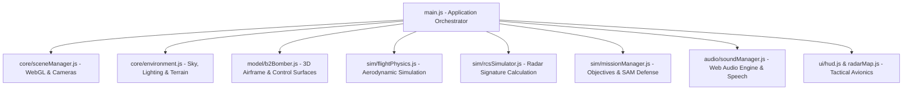

# ✈️ B-2 Spirit Stealth Bomber — 3D Interactive Simulation & Showcase

[](https://threejs.org/)
[](https://vitejs.dev/)
[](https://developer.mozilla.org/en-US/docs/Web/JavaScript)
[](./LICENSE)
[](#)

> An immersive, photorealistic 3D simulation and technical aerospace showcase of the legendary **Northrop Grumman B-2 Spirit Stealth Bomber**. Built with WebGL, Three.js, and modern JavaScript, featuring full flight aerodynamics, Radar Cross Section (RCS) polar analysis, an interactive strike mission mode, procedural audio synthesis and tactical cockpit avionics.

---

## 📸 Overview & Highlights

- **Aeronautical Fidelity**: Authentic flying-wing planform with sweep angles, serrated trailing edges, elevons, split-drag rudder surfaces, conformal radar absorbing materials (RAM) and animated rotary weapon launcher.
- **Dynamic Flight Physics Engine**: Lift, drag, angle-of-attack (AoA), induced drag curves, transonic Mach calculations, stall dynamics, ground effect and fly-by-wire stability augmentation.
- **RCS (Radar Cross Section) Simulator**: Real-time polar RCS pattern evaluation accounting for aspect angle, open weapons bay exposure, and deployed landing gear radar reflections.
- **Operation Dark Skies (Combat Mission Mode)**: Infiltrate hostile airspace, evade active SAM radar tracking envelopes, lock on enemy ground installations open bomb bay doors and deliver precision-guided JDAM ordnance.
- **Procedural Tactical Audio Engine**: Web Audio API-powered twin turbofan acoustic model, hydraulic actuator servos, sonic flyby sound effects and synthetic cockpit voice warnings (*"Pull up"*, *"Weapons bay open"*, *"Autopilot engaged"*).
- **Multiple Sensor Visual Modes**: Switch between Tactical Matte Stealth, Wireframe Mesh, Thermal FLIR Infrared and Internal Structural X-Ray views.
- **Atmospheric Environments**: High-altitude Stratosphere, Dawn/Sunset twilight, Night Infiltration and High Noon lighting conditions with dynamic sky scattering and terrain generation.

---

## 🎮 Flight Controls & Hotkeys

| Key / Control | Function | Description |
| :--- | :--- | :--- |
| <kbd>W</kbd> / <kbd>S</kbd> or <kbd>↑</kbd> / <kbd>↓</kbd> | **Pitch** | Pitch nose down / up (elevon deflection) |
| <kbd>A</kbd> / <kbd>D</kbd> or <kbd>←</kbd> / <kbd>→</kbd> | **Roll** | Differential elevon roll left / right |
| <kbd>Q</kbd> / <kbd>E</kbd> | **Yaw** | Split-drag rudder yaw control |
| <kbd>Shift</kbd> / <kbd>Ctrl</kbd> (or <kbd>X</kbd>) | **Throttle** | Accelerate / decelerate engine thrust |
| <kbd>Space</kbd> | **Drop Weapon** | Release precision-guided JDAM bomb from rotary launcher |
| <kbd>B</kbd> | **Bomb Bay Doors** | Toggle pneumatic weapons bay doors (affects RCS signature) |
| <kbd>G</kbd> | **Landing Gear** | Deploy or retract tricycle landing gear |
| <kbd>F</kbd> | **Airbrake** | Deploy split control surfaces for rapid deceleration |
| <kbd>H</kbd> | **Autopilot** | Level flight & barometric altitude hold |
| <kbd>1</kbd> – <kbd>6</kbd> | **Camera Views** | Orbit (1), Chase (2), Cockpit (3), Bomb Bay (4), Blueprint (5), Flyby (6) |

---

## 🛠️ Architecture & Tech Stack



### Core Technologies
- **Rendering & 3D Math**: [Three.js (r170)](https://threejs.org/)
- **Bundler & Tooling**: [Vite 6](https://vitejs.dev/)
- **UI & Icons**: [Lucide Icons](https://lucide.dev/)
- **Audio System**: Web Audio API (procedural synthesis, no external audio files required) & Web Speech Synthesis API
- **Styling**: Vanilla modern CSS with glassmorphism, responsive HUD overlays and military-grade typography

---

## 🚀 Getting Started

### Prerequisites
- Node.js (version 18.0 or higher recommended)
- npm, pnpm, or yarn
- Modern web browser with WebGL 2.0 support (Chrome, Edge, Firefox, Safari)

### Quickstart

1. **Clone the repository:**
   ```bash
   git clone https://github.com/Vivekkumar161122/b2-spirit-stealth-bomber-3d.git
   cd b2-spirit-stealth-bomber-3d
   ```

2. **Install dependencies:**
   ```bash
   npm install
   ```

3. **Start local development server:**
   ```bash
   npm run dev
   ```
   Open your browser at `http://localhost:5173` to launch the simulator.

4. **Build production bundle:**
   ```bash
   npm run build
   ```
   The optimized production bundle will be output to the `dist/` directory.

5. **Preview production build locally:**
   ```bash
   npm run preview
   ```

---

## 📂 Project Structure

```
3D_fighterjet/
├── index.html              # Entry HTML with meta tags and viewport settings
├── package.json            # Project dependencies and npm scripts
├── vite.config.js          # Vite build and server configuration
├── .gitignore              # Git ignore rules for node_modules, dist, logs
├── LICENSE                 # MIT License
├── README.md               # Documentation and flight manual
└── src/
    ├── main.js             # Main simulation coordinator & animation loop
    ├── style.css           # Tactical UI styling, military HUD theme & overlays
    ├── audio/
    │   └── soundManager.js # Procedural audio synthesis (turbofans, servos, alarms, voice)
    ├── core/
    │   ├── environment.js  # Atmospheric scattering, lighting presets & procedural ground
    │   └── sceneManager.js # Camera perspectives, post-processing & WebGL renderer
    ├── model/
    │   ├── b2Bomber.js     # Airframe geometry, control surfaces, weapons & gear
    │   ├── landingGear.js  # Retractable landing gear kinematics
    │   ├── materials.js    # RAM coatings, stealth liveries & shader modes
    │   └── weaponsBay.js   # Pneumatic bay doors & rotary bomb dispenser
    ├── sim/
    │   ├── flightPhysics.js# Full 6-DOF flight dynamics, lift/drag/stall model
    │   ├── missionManager.js# Operation Dark Skies mission logic, targets & SAM radar
    │   └── rcsSimulator.js # Polar Radar Cross Section calculation engine
    └── ui/
        ├── controlsUI.js   # Glassmorphism control panel & telemetry sliders
        ├── hud.js          # Tactical HUD with pitch ladder, heading tape & flight metrics
        └── radarMap.js     # Real-time top-down tactical radar scope
```

---

## 🛡️ License

This project is licensed under the [MIT License](./LICENSE) — see the LICENSE file for details.

---

## 👨‍💻 Author

**Vivek Kumar**
- GitHub: [@Vivekkumar161122](https://github.com/Vivekkumar161122)
- Website: [aiarambh.com](https://aiarambh.com)
- Focus: Artificial Intelligence, Machine Learning & Interactive 3D Web Graphics

---

*Northrop Grumman B-2 Spirit is a registered trademark of Northrop Grumman Systems Corporation. This project is an independent educational 3D aerospace and simulation demonstration.*
